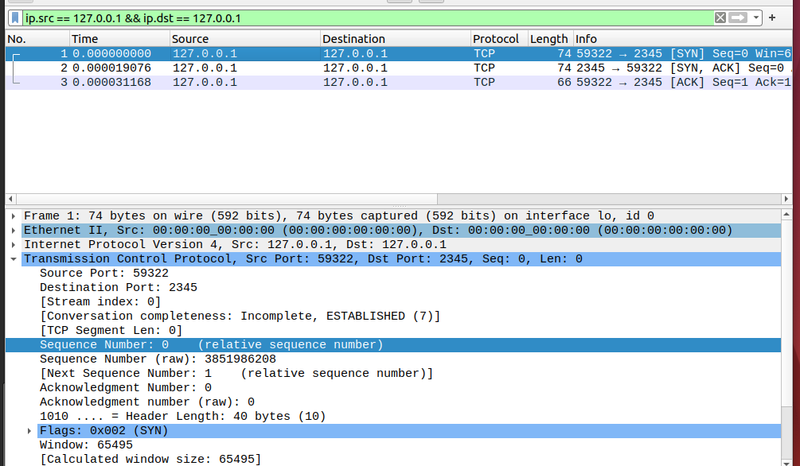
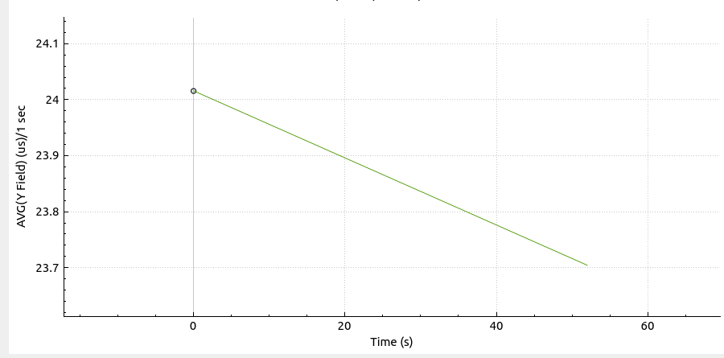
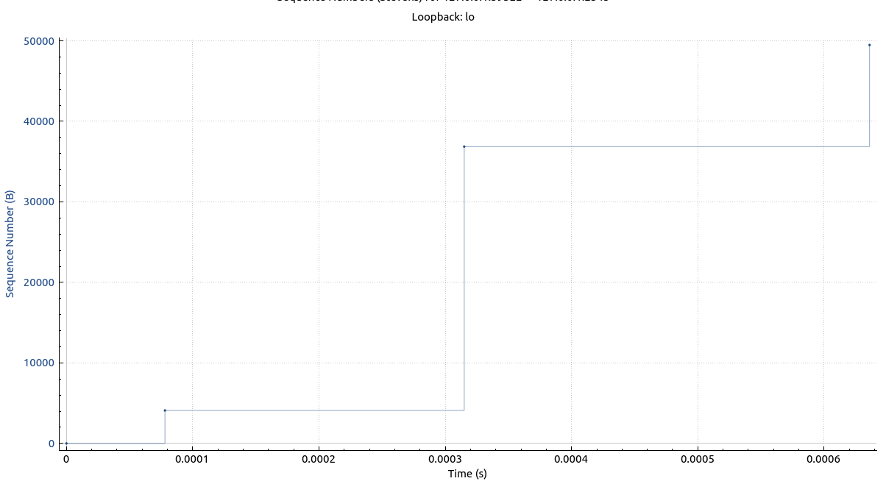

# TCP
## Question 1
The TCP SYN segment that is used to initiate the TCP connection has the segment number 0.

## Question 2
The first two sequence numbers of the TCP connection are both 0. 

The first one was sent at time 0. the second one was send at time 0.000019076.

The ACK for the first segment arrived at 0.000019076. The second ACK arrived at 0.00031168

## Question 3
RTT1 = 0.000019347
RTT2 = 0.000022311

## Question 4
The receiver typically acknowledges all of the previous bytes sent. 

## Question 5
No there are no instances where there was a retransmission of data. We would know there was a retransmissions if the ack number went down. It does not go down.

## Question 6
The throughput of the TCP connection is 49473 bytes/0.000636748 seconds = 77 696 357 Bps
To calcualte this value, the file size is divided by the amount of time it too to transfer the file. This ensures that we are not counting the TCP overhead into the throughput.

## Question 7

# UDP
## Question 1
The UDP overhead can be calculated to be 4104-4096=8 bytes. 

## Question 2
The maximum UDP payload size is 65527 bytes. 

## Question 3
The UDP protocol numer is 17 in decimal and 0x11 in hexadecimal
